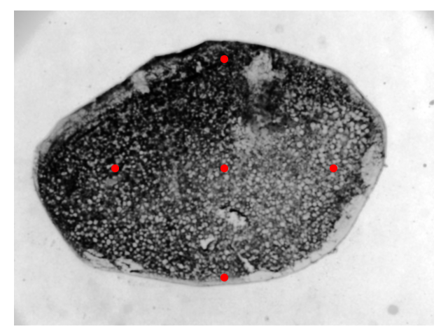
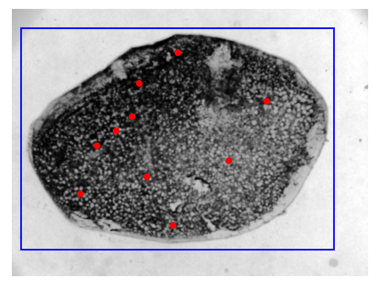

# scale_morphology
Shape analysis of Zebrafish scales.

## Motivation
Fish scales are bones - the shape of a fish's scales tells us about bone growth in the organism.
We can use this to measure the effect of mutations, age, sex, etc. on bone growth and regeneration.

## Quick Start
1. Install `uv`.
2. Run `uv sync` to install the environment.
3. Run the scripts in `scripts`. More detail is below.

#### A note on the code
This is very much still an exploratory codebase, so there's lots of half-finished analysis
scripts, old ways of doing things and unused code around. The scripts in `scripts/` should
do everything you need to just do the analysis, but there's lots of other bits around too.
Probably don't worry about them too much, I just didn't have time to tidy everything up.

## The scripts
<details>
<summary>Step 1: segmentation</summary>

### Segmentation
The zeroth thing to do is to take some pictures with a microscope or something and save them somewhere, e.g. the RDSF.

Once you have done that, you will want to segment the scales out.
We can do this mostly-automatically, using the [Segment Anything](https://github.com/facebookresearch/segment-anything) model.

The [script](./scripts/1-automatic_segmentation.py) to do this will:
 - read in scale images from the directory you point it at
 - attempt to find a "prior" for the segmentation
 - use the segmentation model (and the prior) to segment out the scale

By default, this script runs on a GPU (because this is much faster than using a CPU).
If you don't have a GPU on your laptop then you could try running this on a remote machine
that does have one - the biomed group has access to the `scampi` server which you can get
access to by asking your PI.

Run the script as follows:
```
uv run scripts/1-automatic_segmentation.py my_scale_dir/ my_segmentations_dir/
```

The following options can also be provided:
 - `-h`, `--help`: print help message
 - `--prior-type`: whether we are segmenting ALP stained or confocal image scales.
 - `--debug-plot-dir`: if provided, will plot some extra outputs (like the prior) here
 - `--device`: defaults to `cuda`, but can also be set to `cpu`.

A complete example is:
```
uv run scripts/1-automatic_segmentation.py my_scale_dir/ my_segmentations_dir/ --prior-type confocal --debug-plot-dir my_debug_plots/ --device cpu
```

### The Segmentation Prior
The segmentation sometimes doesn't "just work" if we simply pass the raw scales to the model.
This is because there's often dark/light parts to the scale (the bits that overlap/don't) and the
model detects these as different objects.

To get around this, we pass a "prior" to the model - this is some extra information that it can
use to decide where the object of interest is in the image.
This might be some points that we demand are contained within the segmentation mask,
or a bounding box around it (or both).

For the confocal image, the prior is simple - we simply assume that the scale is in the middle
of the image, and define five points that we will enforce are in the segmentation mask.

The prior points might be too close/far apart depending on the magnification of your images - you'll have to change a number
in the script to change this.

The ALP prior is more complicated; we first do a rough segmentation by attempting to threshhold out the scale, and then
use this to build our prior. In order:
 1. We make a rough segmentation of the scale by thresholding
 2. We attempt to clean this segmentation by filling holes, removing small objects and removing
   objects touching the border of the image
 3. We sample some points randomly from this mask
 4. We find the bounding box of this mask
The points and bounding box from steps 3. and 4. are used as the prior.


### A Note on Confocal Segmentation
Confocal segmentation was just something we quickly tried once.
It might not work well.

</details>

## Other bits
<details>
<summary>New to uv?</summary>
uv is a python package manager that makes setup easy -
like conda, it manages virtual environments, but is much faster
and easier to use.

> Download `uv` from [here](https://docs.astral.sh/uv/#installation).
</details>

<details>
<summary>Mounting the RDSF</summary>
The RDSF (Research Data Storage Facility) is Bristol Uni's research
data repository.

You will need to be added to the Zebrafish_Osteoarthritis project
in order to read data from it - ask your PI for access if you
don't have this already.

There are [several ways](https://www.bristol.ac.uk/acrc/research-data-storage-facility/accessing-the-rdsf/)
for users to access the RDSF; if you're on Linux I recommend:

`gio mount smb://rdsfcifs.acrc.bris.ac.uk/Zebrafish_Osteoarthritis`

It will then prompt you for:
- username (use your UoB username)
- workgroup (`UOB`)
- password ()

If you're on Windows, I recommend using installing WSL
(Windows Subsystem for Linux), cloning this project there and
using the Linux CLI for this project.

If you really want to use Windows, at use the git bash terminal.
</details>

<details>
<summary>An example</summary>

## Example Workflow
The real files used for the analysis live in [this directory](./scripts/),
which go through the segmentation/cleaning/analyses steps.

An example workflow that uses some example data can be found in
[src/scale_morphology/test/example_workflow.py](./src/scale_morphology/test/example_workflow.py): this runs through
the EFA/PDA/LDA workflow using a toy dataset of different
shapes:


We perform EFA on these, and can find the (e.g.) ten most
descriptive axes in terms of the EFA coefficients:


We then finally run LDA on the PCA coefficients; this is far less noisy and prone to overfitting than running LDA on the
raw EFA coefficients, but keeps most of the variation:


</details>
