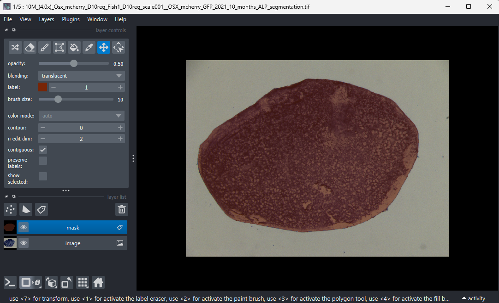

# scale_morphology
Shape analysis of Zebrafish scales.

## Motivation
Fish scales are bones - the shape of a fish's scales tells us about bone growth in the organism.
We can use this to measure the effect of mutations, age, sex, etc. on bone growth and regeneration.

## Quick Start
1. Install `uv`.
2. Run `uv sync` to install the environment.
3. Run the scripts in `scripts`. More detail is below.

#### A note on the code
This is very much still an exploratory codebase, so there's lots of half-finished analysis
scripts, old ways of doing things and unused code around. The scripts in `scripts/` should
do everything you need to just do the analysis, but there's lots of other bits around too.
Probably don't worry about them too much, I just didn't have time to tidy everything up.

## The scripts
<details>
<summary>Step 1: segmentation</summary>

### Segmentation
The zeroth thing to do is to take some pictures with a microscope or something and save them somewhere, e.g. the RDSF.

Once you have done that, you will want to segment the scales out.
We can do this mostly-automatically, using the [Segment Anything](https://github.com/facebookresearch/segment-anything) model.

The [script](./scripts/1-automatic_segmentation.py) to do this will:
 - read in scale images from the directory you point it at
 - attempt to find a "prior" for the segmentation
 - use the segmentation model (and the prior) to segment out the scale

By default, this script runs on a GPU (because this is much faster than using a CPU).
If you don't have a GPU on your laptop then you could try running this on a remote machine
that does have one - the biomed group has access to the `scampi` server which you can get
access to by asking your PI.

Run the script as follows:
```
uv run scripts/1-automatic_segmentation.py my_scale_dir/ my_segmentations_dir/
```

The following options can also be provided:
 - `-h`, `--help`: print help message
 - `--prior-type`: whether we are segmenting ALP stained or confocal image scales.
 - `--debug-plot-dir`: if provided, will plot some extra outputs (like the prior) here
 - `--device`: defaults to `cuda`, but can also be set to `cpu`.

A complete example is:
```
uv run scripts/1-automatic_segmentation.py my_scale_dir/ my_segmentations_dir/ --prior-type confocal --debug-plot-dir my_debug_plots/ --device cpu
```

### The Segmentation Prior
The segmentation sometimes doesn't "just work" if we simply pass the raw scales to the model.
This is because there's often dark/light parts to the scale (the bits that overlap/don't) and the
model detects these as different objects.

To get around this, we pass a "prior" to the model - this is some extra information that it can
use to decide where the object of interest is in the image.
This might be some points that we demand are contained within the segmentation mask,
or a bounding box around it (or both).

For the confocal image, the prior is simple - we simply assume that the scale is in the middle
of the image, and define five points that we will enforce are in the segmentation mask.

The prior points might be too close/far apart depending on the magnification of your images - you'll have to change a number
in the script to change this.

The ALP prior is more complicated; we first do a rough segmentation by attempting to threshhold out the scale, and then
use this to build our prior. In order:
 1. We make a rough segmentation of the scale by thresholding
 2. We attempt to clean this segmentation by filling holes, removing small objects and removing
   objects touching the border of the image
 3. We sample some points randomly from this mask
 4. We find the bounding box of this mask
The points and bounding box from steps 3. and 4. are used as the prior.


### A Note on Confocal Segmentation
Confocal segmentation was just something we quickly tried once.
It might not work well.

</details>

<details>
<summary>Step 2: cleaning segmentations</summary>

### Cleaning Segmentations
Once you have some rough segmentations by running step 1, you will want to clean
them. From experience, around 10% of the automatic segmentation masks will have
some problem that needs to be corrected - this might be because the AI model
misidentified the object in the image, because the boundary was not clear or
because some other object (a bubble, hair, blob of loose dye) got caught up in
the segmentation too.

This script will open a GUI for interactively cleaning the scale segmentations:
it opens a MS-paint like interface where you can draw/erase/fill/etc. the
segmentation mask in an interactive way.

This is what it looks like:



To open the GUI, run:
```
uv run scripts/2-clean_segmentations.py --img_dir my_img_dir/ --mask_dir my_mask_dir --output_dir my_output_dir/
```

You will need to run this **locally** - i.e. on your laptop, not on a remote 
server like `scampi` (since it might not have a display).
It's probably possible to get this to work on a remote machine with X11
forwarding, but I haven't tried.

Once you have run this and cleaned the segmentations, you should have a
directory of nice clean segmentations. This is what we will use for the
analysis.

</details>

<details>
<summary>Step 3: run a quick analysis</summary>

### Quick Analysis: Size & Aspect Ratio
We care about the shape of our scales; a simple way to quantify these
is by taking some simple features (size and aspect ratio) and plotting
them on a scatter plot.

To do this, starting from a directory of cleaned segmentations:
```
uv run scripts/3-quick_ellipse_analysis.py my_clean_seg_dir/ sex
```

#### Metadata (sex, age, etc.)
When making these plots, we need to somehow find the sex/age/onto-regen status/... of the fish.
We do this by looking at the filename - the scales (usually)
follow a naming convention that allows us to extract the

If you only want to run on a subset of the data (e.g plot a scatter
plot of age showing only female fish), you'll have to change the
source code to just pick out the right scales for you.
It isn't a difficult change, but it still does require changing the 
code.

</details>

<details>
<summary>Step 4: run the EFA analysis</summary>

This is where the code gets a bit more **"exploratory"**.

The idea here is that, once we have segmented the scales out, we can use a Elliptic Fourier Analysis (EFA)
to fully describe their shape and then use PCA/LDA to tell us, in an interpretable way, which features
of the scale vary most with some metadata like sex/age/etc.

The [script](./scripts/4-elliptic_fourier_analysis.py) runs through this pipeline and makes some plots.
The mechanics of the EFA parameterisation happens in the [library code](./src/scale_morphology/scales/efa.py);
I have spent some time making sure that the parameterisation is independent of the scale's location/rotation/starting point
of the contour, and that all the coefficients (bar the first) are independent of the scale's size. This, however, does
mean that the coefficients are in a slightly non-standard form.

#### EFA Parameterisation
We can parameterise an ellipse with four coefficients (intuitively this would be the centroid and minor/major axes lengths).

In EFA, we describe our shape as a sum of ellipses (effectively) - here's some formulae:

$$
\begin{aligned}
x(t) &= a_0 + \sum_{n=1}^{N} \big[a_n \cos(n t) + b_n \sin(n t)\big],\\
y(t) &= c_0 + \sum_{n=1}^{N} \big[c_n \cos(n t) + d_n \sin(n t)\big],
\qquad t \in [0, 2\pi].
\end{aligned}
$$

with:

$$
\begin{aligned}
a_0 = \frac{1}{2\pi}\int_{0}^{2\pi} x(t)\,dt,\qquad
c_0 = \frac{1}{2\pi}\int_{0}^{2\pi} y(t)\,dt.
\end{aligned}
$$

$$
\begin{aligned}
a_n &= \frac{1}{\pi}\int_{0}^{2\pi} x(t)\cos(n t)\,dt, &
b_n &= \frac{1}{\pi}\int_{0}^{2\pi} x(t)\sin(n t)\,dt,\\
c_n &= \frac{1}{\pi}\int_{0}^{2\pi} y(t)\cos(n t)\,dt, &
d_n &= \frac{1}{\pi}\int_{0}^{2\pi} y(t)\sin(n t)\,dt.
\end{aligned}
$$

The $(a_i, b_i, c_i, d_i)$ here are the four coefficients here that describe each ellipse.

This means that we can describe our shape with a vector like:

$$(a_1, b_1, c_1, d_1, a_2, b_2, ...)$$
once we have removed the centroid $(a_0, c_0)$.

However, a few of these parameters are redundant - once we normalise for rotation the $b_1$ and $c_1$ parameters are always 0. We also want to normalise
the coefficients but keep size information, so we will divide all the coefficients by $a_1$ and then replace the first coeff (which is always 1, since it's $a_0 / a_0$) with the size of the scale.

This gives us our final EFA parameterisation convention:
$$\left(\mathrm{size}, d_1, a_2, b_2, b_3, b_4, a_3, ...\right)$$

Intuitively, $d_1$ is the aspect ratio of the first ellipse.

Other normalisations include rotating each harmonic to have a relative phase of
0 and the starting point of the contour to be the same - see the code for details.

</details>

## Other bits
A more technical explanation, suitable for a writeup, can be found
in [./paper/manuscript.tex](./paper/manuscript.tex)
<details>
<summary>New to uv?</summary>
uv is a python package manager that makes setup easy -
like conda, it manages virtual environments, but is much faster
and easier to use.

> Download `uv` from [here](https://docs.astral.sh/uv/#installation).
</details>

<details>
<summary>Mounting the RDSF</summary>
The RDSF (Research Data Storage Facility) is Bristol Uni's research
data repository.

You will need to be added to the Zebrafish_Osteoarthritis project
in order to read data from it - ask your PI for access if you
don't have this already.

There are [several ways](https://www.bristol.ac.uk/acrc/research-data-storage-facility/accessing-the-rdsf/)
for users to access the RDSF; if you're on Linux I recommend:

`gio mount smb://rdsfcifs.acrc.bris.ac.uk/Zebrafish_Osteoarthritis`

It will then prompt you for:
- username (use your UoB username)
- workgroup (`UOB`)
- password ()

If you're on Windows, I recommend using installing WSL
(Windows Subsystem for Linux), cloning this project there and
using the Linux CLI for this project.

If you really want to use Windows, at use the git bash terminal.
</details>

<details>
<summary>An example</summary>

## Example Workflow
The real files used for the analysis live in [this directory](./scripts/),
which go through the segmentation/cleaning/analyses steps.

An example workflow that uses some example data can be found in
[src/scale_morphology/test/example_workflow.py](./src/scale_morphology/test/example_workflow.py): this runs through
the EFA/PDA/LDA workflow using a toy dataset of different
shapes:


We perform EFA on these, and can find the (e.g.) ten most
descriptive axes in terms of the EFA coefficients:


We then finally run LDA on the PCA coefficients; this is far less noisy and prone to overfitting than running LDA on the
raw EFA coefficients, but keeps most of the variation:


</details>
