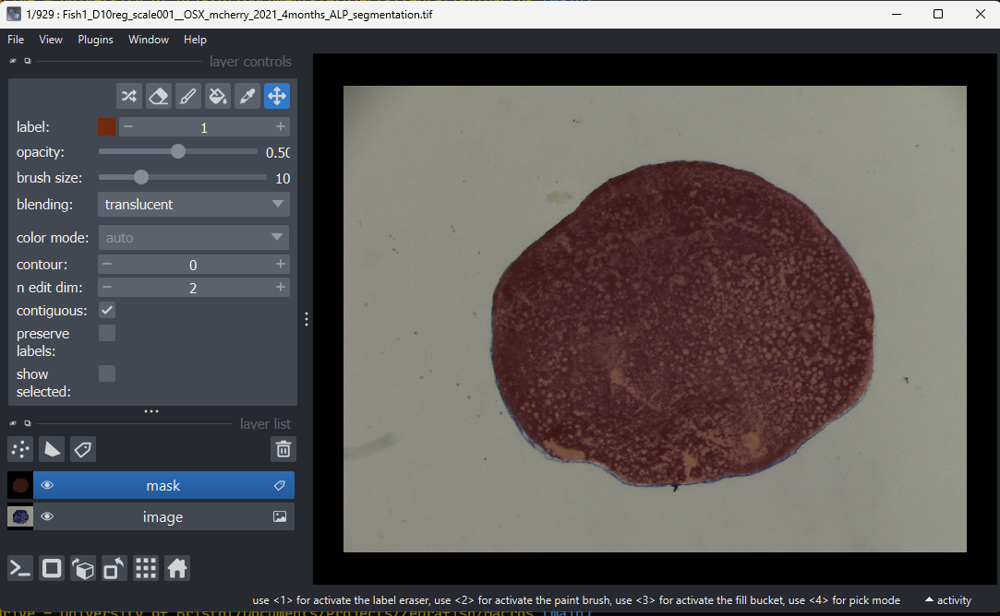

Cleaning Segmentations
====
The automatic segmentation is quite good but not perfect, so you will likely want to manually
look through the segmentatations and correct any that are obviously wrong (e.g. where we've
accidentally segmented a bubble out instead of the scale).

There is a python script at [src/segmentation/clean_segmentations.py](../src/segmentation/clean_segmentations.py)
that will open an easy to use interface for cleaning the segmentations:



There a few steps to run the script, which might be new to you if you haven't done any/much programming before.
I've tried to write them down in full detail below, but if you have any difficulties try emailing someone
at the JGI for help - maybe try ask-jgi@bristol.ac.uk with subject line
"Chrissy Hammond's Zebrafish project - help running python notebook".

## 1. (Windows only) Install git bash
If you're on Windows, the built-in terminals (command prompt or powershell)
are annoying to use and might end up doing the wrong thing.
I'd suggest installing the git from [here](https://git-scm.com/install/windows)
which will also install the git bash terminal.

You don't need to do this on Mac or Linux, because the built-in terminals
will be good enough. You will need to install git though, which you can
also do from the above link.

## 2. Open a terminal
On Windows, enter "git bash" into your Windows search bar and open it.
The icon will look like this:


On Mac, open a terminal with the "Terminal" program.

## 3. Clone this repo
You're probably reading this page on the GitHub website right now.
To access the code on your computer, you will need to copy the code that is
hosted on this website onto your laptop.

We'll do that using git, using the clone operation. Enter this into your terminal:

> [!TIP]
> Copy and paste this into your terminal:
```
git clone https://github.com/JGIBristol/scale_morphology.git
```

You should get some output that looks like:


> Cloning into 'scale_morphology'...  
> remote: Enumerating objects: 1452, done.  
> remote: Counting objects: 100% (136/136), done.  
> remote: Compressing objects: 100% (62/62), done.  
> remote: Total 1452 (delta 94), reused 92 (delta 73), pack-reused 1316 (from 1)  
> Receiving objects: 100% (1452/1452), 3.47 MiB | 11.62 MiB/s, done.  
> Resolving deltas: 100% (861/861), done.

Now move into the directory using the `cd` (**c**hange **d**irectory) command:
> [!TIP]
> Copy and paste this into your terminal:
```
cd scale_morphology
```

## 4. Install uv
To run our script, we will need to install python and the right libraries.
This can be quite fiddly, so we'll use `uv` to sort everything out for us.

This does mean that we'll need to install one more thing: enter
[this](https://docs.astral.sh/uv/getting-started/installation/#__tabbed_1_1) 
into your terminal:
> [!TIP]
> Copy and paste this into your terminal:
```
curl -LsSf https://astral.sh/uv/install.sh | sh
```
Verify that it has installed by entering
> [!TIP]
> Copy and paste this into your terminal:
```
which uv
```
You should see output like:
> /c/Users/<your username>/.local/bin/uv

## 5. Set Configuration (using nano?) - RDSF mount, seg dir, img dir, out dir

## 6. Optional - zip the tifs?

## 7. run with `uv run`

## 8. Correct the segmentations
